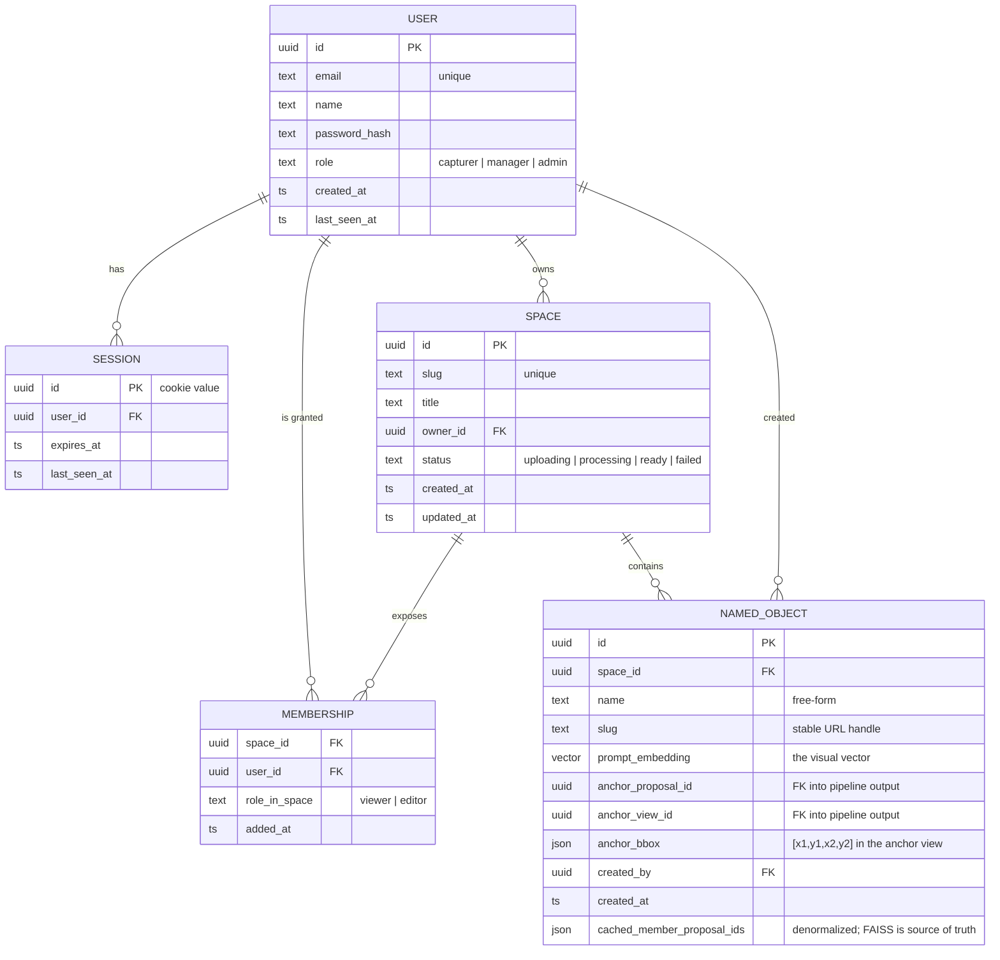

# Data model — ERD

Companion to `USER_MODEL.md`. Diagram and notes.

## Diagram (Mermaid — renders on GitHub / VS Code / Mermaid Live Editor)



## ASCII version (so this doc reads without a Mermaid renderer)

```
                 ┌─────────┐
                 │  USER   │
                 ├─────────┤
                 │ id PK   │
                 │ email   │  unique
                 │ name    │
                 │ role    │  capturer | manager | admin
                 │ ...     │
                 └─┬───┬─┬─┘
       ┌───────────┘   │ └───────────────────────┐
       │1              │1                        │1
       ▼N              ▼N                        ▼N
  ┌─────────┐    ┌──────────────┐         ┌───────────────┐
  │ SESSION │    │  SPACE       │         │ NAMED_OBJECT  │
  ├─────────┤    ├──────────────┤         ├───────────────┤
  │ id PK   │    │ id PK        │←┐       │ id PK         │
  │ user_id │    │ slug unique  │ │       │ space_id FK   │
  │ expires │    │ owner_id FK  │ │ N     │ name          │
  └─────────┘    │ status       │ │       │ slug          │
                 │ ...          │ │       │ prompt_emb    │  vector
                 └──────┬───────┘ │       │ anchor_*      │  proposal/view/bbox
                        │1        │       │ created_by FK │
                        ▼N        │       │ cached_member │  denormalized list
                  ┌─────────────┐ │       │   _proposal_  │
                  │ MEMBERSHIP  │ │       │   ids         │
                  ├─────────────┤ │       └───────┬───────┘
                  │ space_id FK ├─┘1              │N
                  │ user_id  FK │                 │
                  │ role_in_sp  │   ┌─────────────┘
                  └─────┬───────┘   │ created
                        │N          │
                        │           ▼
                        └────────► USER
                                   (above)
```

## Relationships in one sentence each

- **USER ⟶ SESSION (1:N).**  One cookie per device the user is signed in on.
- **USER ⟶ SPACE (1:N, as owner).**  The owner is the canonical permission anchor — can edit, delete, reassign, invite.
- **USER ⟷ SPACE (N:N, via MEMBERSHIP).**  Sharing with collaborators. No row = the user is the owner or has no access. Two roles `viewer` and `editor`. Empty by default.
- **SPACE ⟶ NAMED_OBJECT (1:N).**  Names live inside a space. The same physical object in a different scan = a different `NamedObject` (until we add cross-space promotion later).
- **USER ⟶ NAMED_OBJECT (1:N, as creator).**  We record who named it. The owner of the space can rename or delete any name.

## What's intentionally NOT in the schema

- **Object class taxonomy.**  No system-defined "Smoke Detector" vs "Sprinkler". The platform produces *unlabeled* visual vectors; names exist only when a user saves a visual prompt as a `NAMED_OBJECT`.
- **Per-proposal rows.**  The pipeline produces ~1 M object proposals per space. We don't materialize them as DB rows — they live in `proposals.jsonl` + the in-memory search index, addressed by integer `proposal_id`. `anchor_proposal_id` is just that integer plus the space scope.
- **User search preferences.**  Match-quality thresholds, ranking weights, top-K sliders — none of these are persisted. The UI used to expose a Match-quality filter; that was dropped because the ranked list and per-row `92% match` score already communicate confidence.
- **Teams / orgs.**  Per-user only for v1. Sharing is via Membership rows. A future "Team" entity could replace the Membership pivot.
- **API tokens, webhooks, audit log, quotas, billing.**  Out of scope until asked.

## Suggested storage

```
SQLite at /var/infrascan/db.sqlite  (single-file, fits the scale)
  • users          one row per user
  • sessions       one row per cookie; sweep expired hourly
  • spaces         one row per registered space (mirrors spaces.json today)
  • memberships    composite PK (space_id, user_id)
  • named_objects  prompt_embedding stored as BLOB (float32 × 768 = 3 072 B)

Embeddings on disk           — proposals.jsonl + index.faiss per space, unchanged.
Hot path: query / similarity — RAM-resident FAISS, no DB hit.
DB only touched for          — auth, ownership checks, named-object metadata.
```

## Migration order (when we wire this up)

1. `users` + `sessions` only. Replace the SHA-256 shared cookie. **No data migration needed.**
2. `spaces` rows seeded from `spaces.json`. Owner = the user who registered the space. Manual one-time backfill.
3. `memberships` table empty at first; populated via the "Share" button on space-detail.
4. `named_objects` empty at first; grows organically as users name visual prompts.

No big-bang migration — each step is additive.
